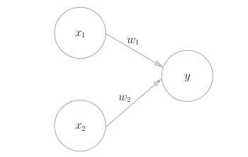

感知机
======

什么是感知机
------------
* **感知机图示**

========  ===========================
输入       拥有各自权重的多个信号
输出       一个信号（0 或 1）
判断条件   是否超过某个阈值
========  ===========================

* **感知机的数学表达式**

  	.. image:: ./images/math1.png

感知机的实现
------------
使用感知机可以表示与门，或门等逻辑电路

* **与门**

.. code-block:: python

	def AND(X1, X2):
		x = np.array([x1, x2])
		w = np.array([0.5, 0.5])
		b = -0.7
		tmp = np.sum(w*x) + b
		if tmp <= 0:
			return 0
		else:
			return 1

* **与非门**

.. code-block:: python
	
	def NAND(x1, x2):
		x = np.array([x1, x2])
		w = np.array([-0.5, -0.5])
		b = 0.7
		tmp = np.sum(w*x) + b
		if tmp <= 0:
			return 0
		else:
			return 1		

* **或门**

.. code-block:: python

	def OR(x1, x2):
		x = np.array([x1, x2])
		w = np.array([-0.5, -0.5])
		b = -0.2
		tmp = np.sum(w*x) + b
		if tmp <= 0:
			return 0
		else:
			return 1

*重点*
 | w1,w2 权重是控制输入信号的重要性
 | b 偏置是调整神经元被激活的容易程度

多层感知机
------------
* **感知机的局限性**

	单层感知机只能表示线性空间（由直线分割的空间）。

* **多层感知机**

	.. image:: ./images/mutiper.png

	| 研究表明激活函数使用了非线性的sigmoid函数的2层感知机可以表示任意函数。
	| 多层感知机理论上可以表示计算机。

* **异或门**

.. code-block:: python

	def XOR(x1, x2):
		s1 = NAND(x1, x2)
		s2 = OR(x1, x2)
		y = AND(s1, s2)
		return y

